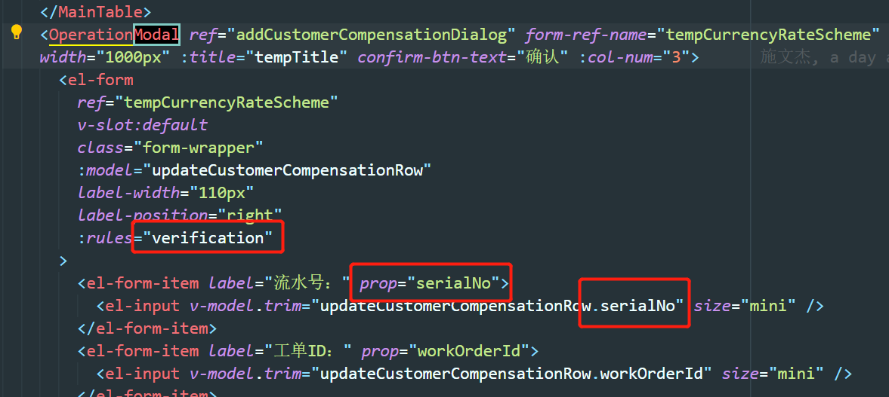

# Element-UI

使用 element-ui 中遇到的问题.


## el-form

校验的时候, 必须 `prop` 跟字段名以及 `rules` 相同.





## el-select

在使用多选框时候. 选中的时候弹出弹窗, 这个时候回到导致 select 一直处于 focus 状态.

解决办法: 可以在 change 事件中使 `el-select` 元素失焦. 

```js
// el-select 提供的失焦事件.
this.$refs.select.blur()
```

