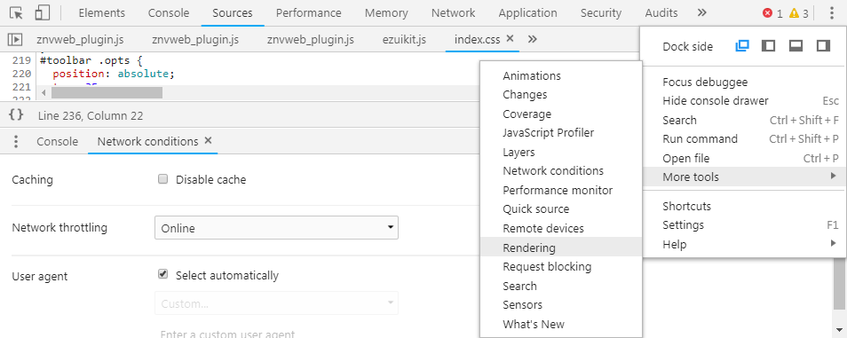
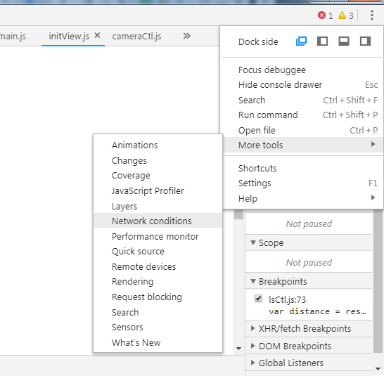

# 调试工具

## Puppeteer

https://juejin.cn/post/6975282946638872584

Puppeteer 是一个 Node 库，它提供了一个高级 API 来通过 DevTools 协议控制 Chromium 或 Chrome。

就跟它在 GitHub 简介中介绍的一样：你在浏览器中手动执行的绝大多数操作都可以使用 Puppeteer 来完成！

- 抓取页面快照
- 生成页面 PDF
- 自动操作页面 DOM

### 链接现有的浏览器

因为puppeteer.launch启动的Chrome浏览器，虽然可以传浏览器启动参数，但是不知道怎么都没能奏效，而且关闭后又不能记住参数配置，真是头疼，上网各种搜索，也是没能解决。于是 ，尝试换了一个思路，就是通过加载一个已经有的浏览器，这个已经安装的浏览器，可以在快捷方式中加启动参数，亲测这个有效。或者直接先打开浏览器，然后，手动配置好了，再启动puppeteer通过调试端口就可以了，算是一种绕路，解决了目前的需求。

第一步，现在Chrome的桌面快捷方式中添加调试启动参数。 方法：快捷方式–右键属性–目标 在最后添加 --remote-debugging-port=9222即可，和.exe之间有个空格。
第二部，在浏览器中请求地址：http://localhost:9222/json/version 是正常的GET请求，获得到webSocketDebuggerUrl参数。
第三步，用 const browser = await puppeteer.connect({
browserWSEndpoint: webSocketDebuggerUrl
});

## DOM 元素截图

## 打开  FPS 

More tools -> Rending -> FPS

## 禁止缓存

More tools -> Network conditions -> disable cache

## 体验新功能

