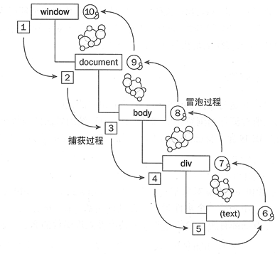

# event 事件相关

## 事件捕获与冒泡



1. 一个完整的JS事件流是从window开始，最后回到window的一个过程.
2. 事件流被分为三个阶段.
   1. (1~5)捕获过程.
   2. (5~6)目标过程.
   3. (6~10)冒泡过程.

### addEventListener 第三个参数

+ true: 事件捕获
+ false: 事件冒泡

### example

```html
<div id="demo">
    <div class="c1"></div>
</div>
```


```js
// 捕获与冒泡
// 捕获 -> 子容器 -> 冒泡
// 第三个参数: false: 事件在冒泡阶段执行, true: 事件在捕获阶段执行
c1.addEventListener( 'click', function ( e ) {
    console.log( '子容器被点击了' );
} );
demo.addEventListener( 'click', function () {
    console.log( '事件发生了冒泡' );
} );
demo.addEventListener( 'click', function () {
    console.log( '事件捕获' );
}, true );

// 事件捕获
// 子容器被点击了
// 事件发生了冒泡
```


## 鼠标左键按住不放事件

`onmousedown`

	通过 `event.button` 来判断

### 不同浏览器下的 event.button 值

+ IE下
  没有按键动作的时候 window.event.button = 0
  左键是 window.event.button = 1
  中键是 window.event.button = 4
  右键是 window.event.button = 2
+ Firefox下
  没有按键动作的时候 event.button = 0
  左键是 event.button = 0
  中键是 event.button = 1
  右键是 event.button = 2
+ 

---


## 取消冒泡

### canelBubble | stopPropagation

+ IE

  ```js
  e.cancelBubble = true;
  ```

+ W3C

  ```js
  e.stopPropagation();
  ```

+ 兼容写法

```js
window.event ? window.event.cancelBubble = true : e.stopPropagation();
event = event || window.event;
```

### stopImmediatePropagation

[MDN][3] [博客][4]

如果其中某个监听函数执行了 `event.stopImmediatePropagation()`方法，则当前元素剩下的监听函数将不会被执行

根据DOM事件流机制，在元素上触发的大多数事件都会冒泡传递到该元素的所有祖辈元素上，如果这些祖辈元素上也绑定了相应的事件处理函数，就会触发执行这些函数。

使用`stopImmediatePropagation()`函数可以阻止当前事件向祖辈元素的冒泡传递，也就是说该事件不会触发执行当前元素的任何祖辈元素的任何事件处理函数。

此外，与 `event.stopPropagation` 函数相比，`stopImmediatePropagation()`函数还会阻止该元素剩余的其他事件处理函数的执行。

此外，由于live()函数并不是将事件处理函数直接绑定到自己身上，而是"委托"绑定到祖辈元素上，由祖辈元素来触发执行。live()函数会先一次性冒泡到文档的顶部，然后为符合条件的元素触发事件。因此，`stopImmediatePropagation()`函数无法阻止live事件的冒泡。

同样地，delegate()函数也是"委托事件函数"，只有事件冒泡传递到"受委托"的祖辈元素才会被触发执行。因此，`stopImmediatePropagation()`函数无法阻止该元素到"受委托"的祖辈元素之间的事件冒泡。


---


## 阻止默认行为

+ IE

  ```js
  e.returnValue = false;
  ```

+ W3C

  ```js
  e.preventDefault()
  ```

> 注意: javascript的return false只会阻止默认行为，而是用 `jQuery` 的话则既阻止默认行为又防止对象冒泡。


---


# 自定义事件

[MDN-CustomEvent][1]

[MDN-create][2]

## 创建

```js
// 不需要设置信息
var event = new Event( 'test' );

// 设置更多信息
var event = new CustomEvent( typeArg, CustomEventInit );
```

```js
// 过时的方法
// Create the event.
var event = document.createEvent('Event');

// Define that the event name is 'build'.
event.initEvent('build', true, true);

// Listen for the event.
document.addEventListener('build', function (e) {
  // e.target matches document from above
}, false);

// target can be any Element or other EventTarget.
document.dispatchEvent(event);
```

## 触发: `dispatchEvent`

参数: `event` 对象, `dom` 对象触发

```js
var cusE = new CustomEvent( 'test' );
document.body.onclick = function ( e ) {
    e.target.dispatch( cusE );
};
```

`typeArg`

	一个代表 `event` 名字的字符串

`CustomEventInit`

	初始化 `event` 

- `detail`: optional and defaulting to `null`, of type any, that is a event-dependant value associated with the event.   可选的默认值是 null 的任意类型数据，是一个与 event 相关的值
- `bubbles`: 一个布尔值，表示该事件能否冒泡。 来自 `EventInit`。注意：测试chrome默认为不冒泡。
- `cancelable`: 一个布尔值，表示该事件是否可以取消。 来自 `EventInit`


## onunload 与 onbeforeunload

[原文链接][1]

+ onunload: 在退出页面的时候出发
+ onbeforeunload: 在退出页面和页面刷星的时候触发

> 有兼容问题

---


## * onVisibilitychange

[原文链接1][3]: 在后台停止播放音乐, 在前台就播放音乐

[原文链接2][4]: 检测页面是否被可见( 页面是否处于后台 )

[online-demo][5]

visibilitychange 事件是浏览器新添加的一个事件，当浏览器的某个标签页切换到后台，或从后台切换到前台时就会触发该消息，现在主流的浏览器都支持该消息了，例如Chrome, Firefox, IE10等

visibilitychange 可以检测是否处于后台, document 的一个属性

```js
// 注册事件, 有兼容问题, 加前缀
document.addEventListener( 'visibilitychange', function () {} );
```

```js
// 获取document.visibilityState属性
function getVisibilityState() {
    var prefixes = ['webkit', 'moz', 'ms', 'o'];
    if ('visibilityState' in document) return 'visibilityState';
    for (var i = 0; i < prefixes.length; i++) {
        if ((prefixes[i] + 'VisibilityState') in document)
            return prefixes[i] + 'VisibilityState';
    }
    // otherwise it's not supported
    return null;
};
```

---


## onpagehide

[原文链接][2]

用户从一个页面离开的时候触发. 

用户离开页面的时机有:

+ 点击一个链接
+ 跟新页面
+ 提交表单( 不阻止默认行为的时候 )
+ 关闭浏览器窗口

有时, onpagehide 可以代替 onunload 事件.

### 如何判断页面是否缓存

可以使用 PageTransitionEvent 对象的 persisted 属性来检测页面是从服务器下载的或是缓存的, 如果缓存了页面, 返回 true, 否则, 返回 false.

---


## srollTop

### 获取 scrollTop 值

```js
document.documentElement.scrollTop //firefox

document.documentElement.scrollLeft //firefox

document.body.scrollTop //IE

document.body.scrollLeft //IE

// 获取 scrollTop 兼容写法
var scrollTop = document.documentElement.scrollTop || window.pageYOffset || document.body.scrollTop;
```

### 设置

```js
// 特效
window.scrollTo({ 
    top: 0, 
    behavior: "smooth" 
});

// 瞬动到指定坐标
window.scrollTo( x, y );
```


---


[1]: https://developer.mozilla.org/zh-CN/docs/Web/API/CustomEvent/CustomEvent
[2]: https://developer.mozilla.org/zh-CN/docs/Web/Guide/Events/Creating_and_triggering_events
[3]: https://developer.mozilla.org/zh-CN/docs/Web/API/Event/stopImmediatePropagation
[4]: http://www.365mini.com/page/jquery-event-stopimmediatepropagation.htm