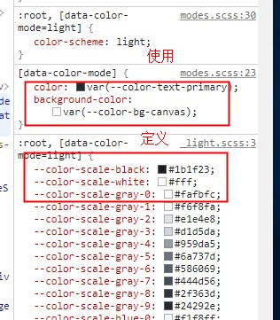

# THEME


## style 中使用 var(--color-xx) 的格式定义以及使用. cs4 的内容



## 使用 less-var 的方式

http://lesscss.org/usage/#using-less-in-the-browser-modify-variables


## 字体图标

SVG 图标颜色修改. 不能有 fill 属性. 否则改不了颜色. 删掉 path 上的 fill 属性即可. 
css 设置 svg 的 fill 属性为 currentColor

```css
.svg-icon[data-v-c8a70580] {
    width: 1em;
    height: 1em;
    vertical-align: -0.15em;
    fill: currentColor;
    overflow: hidden;
}
```

