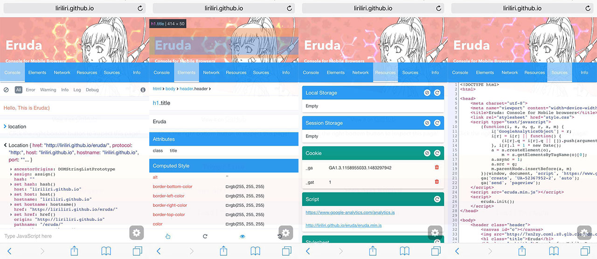

# Plugins

> 使用插件过程中的细节

[如何写一个JavaScript库][5]

## art-template

引用 `lib/template-web.js` 文件, web 使用. 具体请看 [github][1]

[中文文档][2]

[简书例子][4]

在浏览器中预编译: [art-template][3]

### Start

1. 第一种方法: script 标签 + template

```html
<script id="tpl-user" type="text/html">
	<ul>
		{{each list item}}
		<li>{{ item }}</li>
		{{/each}}
    </ul>
</script>
```

```js
/* global template */
var list = [ '摄影', '电影', '民谣', '旅行', '吉他' ];

// 这里变量必须跟上面对应
var html = template( 'tpl-user', {
    list: list
} );

document.getElementById( 'content' ).innerHTML = html;
```

2. 第二中方法: compile => render

```js
//第二种方法，先编译模版，再向模板添加数据，生成html
//API:template.compile(source, options);  编译模板并返回一个渲染函数。
//注意:可以引用外部的文件作为模板。例如用ajax.get来获取模板
//2.1 把字符串编译成模板
var templateStr = '<p>{{data}}</p>';
var render = template.compile(templateStr);
//2.2 向模板添加数据，组装模板
var html = render({
    data: '这是传过去的数据'
});
//2、3 将编译好的html放到目标位置
document.getElementById('container2').innerHTML = html;
```

3. 第三种方法:  引入外部模板文件渲染

```js
//动态引入外部css
function loadCss(url) {
    var link = document.createElement("link");
    link.type = "text/css";
    link.rel = "stylesheet";
    link.href = url;
    document.getElementsByTagName("head")[0].appendChild(link);
};

//引入外部模板和css
function useTemplate(htmlUrl, cssUrl = '') {
    if(htmlUrl == '') return;
    if(cssUrl) {
        loadCss(cssUrl);
    }
    $.get(htmlUrl, function(data) {
        console.log(data);
        var render = template.compile(data);
        var html = render({content:'这是传过去的提示内容'});
        console.log(html);
        document.getElementById('container3').innerHTML = html;
    });
}

useTemplate('alert_template.html', 'alert_template.css');

setTimeout(function() {
    $('.please-login-mask').css('display', 'block');
}, 1000);
```


---


## requireJS

[压缩][9]

### 避免网页失去响应

```html
<script src="js/require.js" defer async="true" data-main="./main.js" ></script>
```

async: IE 浏览器不支持, 使用 defer.

### 属性

+ waitSeconds: 延迟

+ baseUrl

+ paths

+ shim: 设置不支持 AMD 的第三方插件

  ```js
  // example:
  shim: {
  	bootstrap: {
  		exports: 'bootstrap'
  	}
  }
  ```

### 压缩 r.js

1. 按照 `requirejs`, 获取 `r.js`

```bash
npm i -g requirejs
```

2. 创建配置文件 `build.js`

```js
({
    baseUrl: 'C:/Users/ZNV/Documents/GitHub/re',
    name: "./src/index.js",
    out: "main-built.js"
})
```

3. 输入命令行

```bash
node "\Program Files\nodejs\node_modules\requirejs\bin\r.js" -o ./src/build.js
```

#### 配置参数

+ out: 输出文件路径, 以配置文件的位置为基准
+ name: 入口文件路径
+ baseUrl: 必须是本地路径

注意: 路径包含空格可以把路径添加上 `"`.


### config.path

***在入口函数中定义某个模块名的时候, 该模块会变成与入口文件同级目录.***

### 定义变量, 动态添加属性

```js
// var/params
define( [

], function( ) {
    'use strict';

    return {};
} );

```

```js
// ready 函数
define( [
	'./var/params'
], function( params ) {
    'use strict';

    $( function () {
        params.data = 'data';
    } );
} );
```

```js
// ready 函数
define( [
	'./var/params'
], function( params ) {
    'use strict';

    window.onload = function () {
        // 这里就可以访问的到了
        console.log( 'params.data:', params.data );
    }
} );
```

定义只后, 可以动态天机属性, 只要保证执行顺序, 就可以实现将某个对象抽离出来.


---


## Eruda

[GitHub][6]

移动端模拟控制台打印的调试插件.



---


## underscope

[在线文档][7]

Underscore是一个非常简洁、实用的JavaScript库，它没有对原生JavaScript对象进行扩展，而是调用_()方法进行封装，一旦封装完成，原生JavaScript对象便成为一个Underscore对象。也可以通过Underscore对象的value()方法获取原生JavaScript对象中的数据。

```js
_( [ 'a', 'b' ] ).each( function ( index, ele ) {
    console.log( ele );
} );

// ==> a b

// 分组
_.groupBy([1.3, 2.1, 2.4], function(num){ return Math.floor(num); });
// => {1: [1.3], 2: [2.1, 2.4]}

_.groupBy(['one', 'two', 'three'], 'length');
// => {3: ["one", "two"], 5: ["three"]}
```


## 链式调用

```js
var arr = _.filter( [ 1, 2, 3, 4 ], function ( ele, index ) {
    console.log( ele, index );
    return ele % 2;
} ).map( function ( ele, index ) {
    return ele + 10;
} );
console.log( arr );	// 11 13
```

---


## jsmini

[github][8]

一个小巧的使用的函数库

+ clone
+ pubsub
+ is
+ extend
+ base
+ type
+ inherits
+ guid
+ event


---


## jquery.validate

[官方文档][10]    [官网][12]    [GitHub][11]

```js
$( $xm, $gc ).validate( {
    rules: $.extend( {	// 验证规则, 属性名是 name 值
        projectName: {
            required: true,
            maxlength: MAX_LENGTH
        },
        projectAddress: {
            required: true,
            maxlength: MAX_LENGTH
        }
    }, numReg, lenReg ),
    messages: $.extend( { // 错误信息
        projectName: '请输入项目名称',
        projectAddress: '请输入项目地质',
    }, numMsg, lenMsg ),
    errorElement: 'em' // 统计师错误的标签
} );
```


---


## **bootstrap-datetimepicker**

[GitHub][13]    [官网][14]

```js
$date.datetimepicker( {
    format: 'yyyy/mm/dd', // 日期格式化
    autoclose: true, // 组件是否自动隐藏
    todayBtn: true, // 组件是否有 today 按钮
    todayHighlight: 1, // today 是否高亮
    startView: 2, 
    minView: 2,
    forceParse: 0
} );
```

### 坑点

在重置日日期的时候, 官方文档有点坑. 必须传入日期值, 并不会根据 `input` 标签的 `value` 值来自动更新日期.

```js
$target.siblings( '.form_datetime' ).datetimepicker( 'update', val );
```


---

[1]: https://github.com/aui/art-template
[2]: https://aui.github.io/art-template/zh-cn/docs/
[3]: http://aui.github.io/art-template/zh-cn/webpack/
[4]: https://www.jianshu.com/p/183eca899ad7
[5]: https://mp.weixin.qq.com/s/Kx335LCx3VN9AZRjizBu-A
[6]: https://github.com/liriliri/eruda

[7]: http://www.css88.com/doc/underscore/
[8]: https://github.com/jsmini

[9]: https://www.cnblogs.com/rubylouvre/p/3526658.html
[10]: https://jqueryvalidation.org/documentation/
[11]: https://github.com/jquery-validation/jquery-validation
[12]: https://jqueryvalidation.org/
[13]: https://github.com/smalot/bootstrap-datetimepicker
[14]: https://www.malot.fr/bootstrap-datetimepicker/