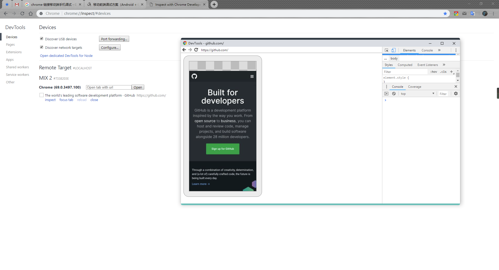
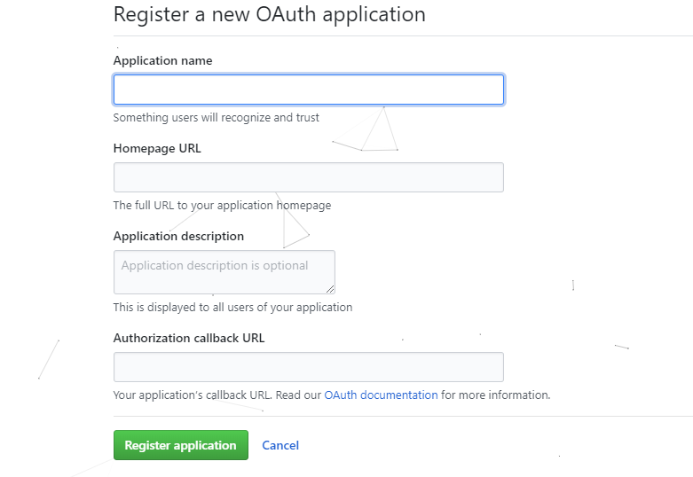
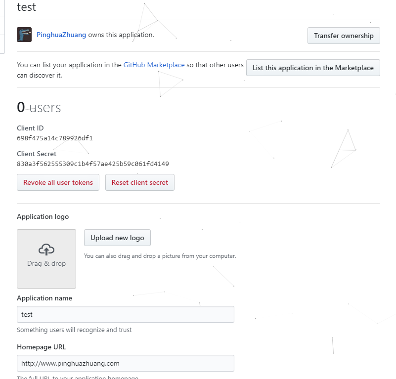

# Bower 浏览器相关


## 移动端改变 chrome 标题栏的颜色

> 只有安卓系统才支持
>
> 要求系统版本好像要到4.2以上，Chrome版本39以上。

原文链接: [developers.google.com][1]

[online-demo][1]

在自己网页的<head></head>标签中加入：

```html
<!-- 16进制颜色值 -->
<meta name="theme-color" content="<!--颜色的HEX代码-->">
```

---


## UID 浏览器唯一标识符

+ 通过 `IE`

  `js` 想获取设备 `MAC`, `ip` 等信息, 只能通过 IE 浏览器下通过 `ActiveX` 取得, 这是由于 `js` 的安全机制导致

+ 创建一个 `UID`, 类似于 `cookies`

  ```js
  // 这个函数可以生成一个随机guid，碰撞几率可以忽略不计，可以认为是唯一的。
  function generateUUID() {
  var d = new Date().getTime();
  var uuid = 'xxxxxxxx-xxxx-4xxx-yxxx-xxxxxxxxxxxx'.replace(/[xy]/g, function(c) {
    var r = (d + Math.random()*16)%16 | 0;
    d = Math.floor(d/16);
    return (c=='x' ? r : (r&0x3|0x8)).toString(16);
  });
  return uuid;
  };
  ```

---


## 浏览器通知 Notification

[MDN][3]

**Notifications API** 允许网页或应用程序在系统级别发送在页面外部显示的通知;这样即使应用程序空闲或在后台，Web应用程序也会向用户发送信息。

> 注意: chrome 下 file 协议打开无效

### 查看权限

**Notification.permission**

`default`

	用户还未被询问是否授权，所以通知不会被显示。
	
	参看 [Getting permission][4] 以了解如何请求显示通知的权限。

`granted`

	表示之前已经询问过用户，并且用户已经授予了显示通知的权限。

`denied`

	用户已经明确的拒绝了显示通知的权限。

### 请求权限

如果权限尚未被授予，那么应用不得不通过 `Notification.requestPermission()` 方法让用户进行选择。这个方法接受一个回调函数，一旦用户回应了显示通知的请求，将会调用这个函数。

```js
window.addEventListener( 'load', function () {
  Notification.requestPermission( function ( status ) {
    // 这将使我们能在 Chrome/Safari 中使用 Notification.permission
    if ( Notification.permission !== status ) {
      Notification.permission = status;
    }
  } );
} );
```

---


## 连接移动端调试技巧

### 利用 chrome 链接手机调试

效果图



1. `PC` 和 手机安卓同一个版本号 `chrome` 浏览器( `IOS` 可能版本对不上 )
2. 使用 USB 连接电脑( 安卓打开`USB`调试 )
3. 打开电脑的chrome 在地址栏输入 `chrome://inspect`  选中 `Discover USB devices` 可以检测到你的设备 

---


## 设置 title 文本信息

```js
document.title = 'hahaha';
```

---


## 第三方登录

基本是后台重定向, 原理: OAuth2.0 协议


### 开发平台

[QQ开发平台][5]

[微信开发平台][6]

[微博开发平台][7]

[github开发平台文档-Creating an OAuth Apps][8]

[github开发平台文档-Authorizing OAuth Apps][9]

> 各个平台第三方接入流程都是差不多的


+ GitHub

  其实文档里面已经清晰的说明了授权登录的主要3个步骤： 

  1. web端重定向[http://github.com/login/oauth/authorize](http://www.voidcn.com/link?url=http://github.com/login/oauth/authorize)； 

     ```js
     // 前端重点是地址的填写
     window.location.href = 'https://github.com/login/oauth/authorize?client_id=75d6ff0d7a95f88acae6&redirect_uri=https://manage.hgdqdev.cn/#/login'
     ```

  2. 根据code获取access_token, 创建成功后 `github` 会提供 `Client ID` 以及 `Client Secret`； 

  3. 根据access_token获取用户信息； 





---


## Service Workers

[在线文档][10]


---

[1]: https://developers.google.com/web/updates/2014/11/Support-for-theme-color-in-Chrome-39-for-Android?hl=en
[2]: https://hodorshy.github.io/example/chrome-title-color.html
[3]: https://developer.mozilla.org/zh-CN/docs/Web/API/notification/Using_Web_Notifications
[4]: https://developer.mozilla.org/zh-CN/docs/Web/API/notification/Using_Web_Notifications#Getting_permission
[5]: https://connect.qq.com/
[6]: https://open.weixin.qq.com/
[7]: https://open.weixin.qq.com/
[8]: https://developer.github.com/apps/building-oauth-apps/creating-an-oauth-app/
[9]: https://developer.github.com/apps/building-oauth-apps/authorizing-oauth-apps/
[10]: https://www.w3ctech.com/topic/866